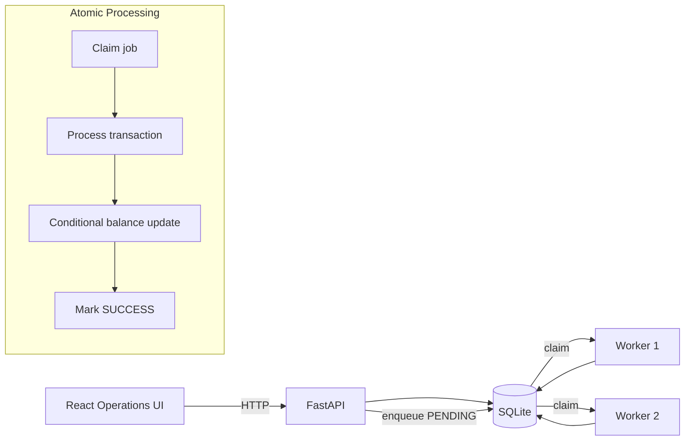

# Architecture

## Processing sequence

1. The API validates the request and checks the customer.
2. The transaction row is inserted with `PENDING` state. The transaction ID is the primary key, providing idempotency.
3. The API returns `202 Accepted` without waiting for the worker.
4. A worker claims one available row using a short `BEGIN IMMEDIATE` transaction.
5. The worker increments the attempt count and changes the row to `PROCESSING`.
6. For CREDIT, the customer balance is increased. For DEBIT, the conditional update only succeeds if enough balance exists.
7. The balance change and `SUCCESS` status are committed in the same DB transaction.
8. If processing fails, the job remains inspectable and can be retried. Stale `PROCESSING` rows are recovered after the configured timeout.

## Important trade-off

The local SQLite queue is intentionally simple and self-contained. `BEGIN IMMEDIATE` protects the short claim operation, but SQLite is not designed for large concurrent write workloads. PostgreSQL plus a durable broker would be the natural production replacement.
